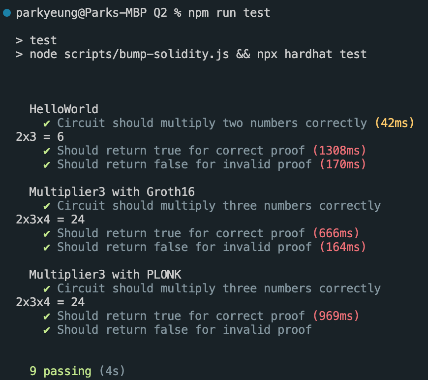

# Week 1 Assignment

## Q1

`1. Explain in 2-4 sentences why SNARK requires a trusted setup while STARK doesn’t.`

When initially setting up a zk-SNARK circuit, it is necessary to generate a set of proving and verifying keys. The process of generating these keys creates 'toxic waste' - a piece of secret information that can be exploited to generate false proofs. For this reason, the toxic waste must be discarded immediately after the generation event. To prevent a single party from acting maliciously, SNARK generation now involves a multi-party computation (MPC) ceremony whereby the proof will remain uncompromised so long as _at least one_ participant is honest and discards their piece of the toxic waste.

STARKs rely on a different cryptographic method (hash functions, rather than elliptic curves) for generating its proofs. This has the beneficial property of requiring no trusted setup, and is also quantum resistant unlike SNARKs.

`2. Name two more differences between SNARK and STARK proofs.`

-   STARKs are quantum resistant, whereas SNARKs are not
-   SNARKs have smaller proof sizes and are computationally cheaper to verify

## Q2

`2.1. What does the circuit in HelloWorld.circom do?`

Takes two inputs, `a` and `b`, and verifies that `c` is equal to their product.

`2.2. Lines 7-12 of compile-HelloWorld.sh download a file called powersOfTau28_hez_final_10.ptau for Phase 1 trusted setup. What is a Powers of Tau ceremony? Explain why this is important in the setup of zk-SNARK applications.`

The Powers of Tau ceremony is a multi-party computation (MPC) procedure for allowing multiple participants to participate in a trusted setup of a SNARK circuit. It has relatively favourable security properties: so long as _at least one_ participant is honest and discards their toxic waste, the whole process can be considered secure. This is desirable, as the more people participating in the ceremony, the more likely it is that the zk-SNARK protocol can be considered secure. If the setup process were not secure (e.g. if the setup was conducted by a single malicious party), it would be possible to generate false proofs and the zk-SNARK application would be compromised.

`2.3. Lines 7-12 of compile-HelloWorld.sh download a file called powersOfTau28_hez_final_10.ptau for Phase 1 trusted setup. What is a Powers of Tau ceremony? Explain why this is important in the setup of zk-SNARK applications.`

Phase 1 of the trusted setup is not specific to the circuit - here, we are simply reusing the `.ptau` file generated by Hermes. Phase 2 of the trusted setup is specific to the circuit and takes in `HelloWorld/circuit_0000.zkey` and `HelloWorld/circuit_final.zkey` as parameters.

`3.2. Try to run compile-Multiplier3-groth16.sh. You should encounter an error[T3001] with the circuit as is. Explain what the error means and how it arises.`

Circom circuits only support quadratic constraints, meaning constraints must be of the form `a * b + c`. `Multiplier3` is non-quadratic as it has the constrant `a * b * c = d`.

`3.3 Modify Multiplier3.circom to perform a multiplication of three input signals under the restrictions of circom.`

```
signal e;

e <-- b * c;
d <== a * e;
```

`4.1. You will encounter an error zkey file is not groth16 if you just change snarkjs groth16 setup to snarkjs plonk setup. Resolve this error and answer the following question - How is the process of compiling with PLONK different from compiling with Groth16? `

With PLONK, there is no requirement for a trusted setup ceremony, so we do not need to go through Powers of Tau and add sequential contributions to the circuit.

`4.2. What are the practical differences between Groth16 and PLONK? Hint: compare and contrast the resulted contracts and running time of unit tests (see Q5 below) from the two protocols.`

PLONK has a larger proof size than Groth16 (the contract has around 3x the amount of code). Running time of unit tests is likely also to be longer as PLONK is more computationally expensive.

`5.3. In test/test.js, add the unit tests for Multiplier3 for both the Groth16 and PLONK versions. Include a screenshot of all the tests (for HelloWorld, Multiplier3 with Groth16, and Multiplier3 with PLONK) passing in your PDF file.`


